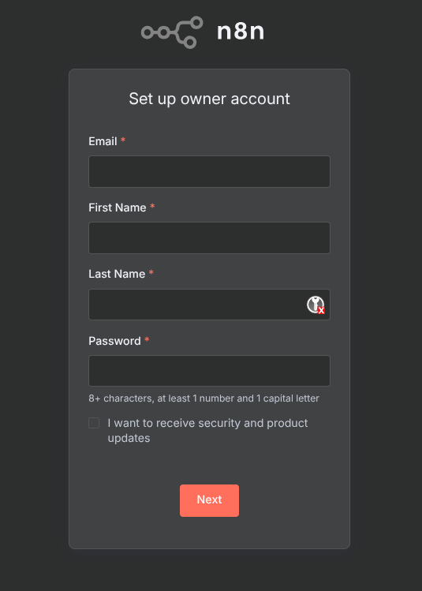
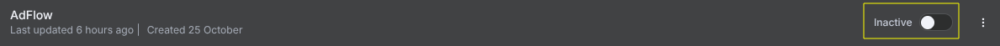

</div>

<br>


**RAVEN8 è una piattaforma avanzata di penetration testing automatizzato** che sfrutta l'Intelligenza Artificiale Generativa (GenAI) per identificare le vulnerabilità critiche e memorizza i risultati in un database vettoriale per correlazioni avanzate.  
Progettato per security analyst, red team e penetration tester, combina automazione avanzata con analisi intelligente per:
- Scansionare target web in modo autonomo
- Identificare vulnerabilità critiche
- Generare report dettagliati con remediation

## Prerequisiti
- Docker e Docker Compose installati
- Account per i servizi e API: 
  - [n8n](https://github.com/n8n-io/n8n)
  - Google Gemini API
  - Google Sheets API
  - Google Drive API
  - huggingface API
  - Typeform API

## Configurazione Iniziale

### 1. Configurazione variabili d'ambiente
Creare un file `.env` nella root del progetto con:

```bash
LETSENCRYPT_EMAIL=<Email-personale>
DOMAIN_NAME=<Dominio>
SUBDOMAIN_NAME=<SottoDominio>
```

### 2. Avvio dei container Docker
```bash
docker compose build
docker compose up -d
```

## Setup Piattaforma

### 3. Registrazione su n8n
1. Accedi a: `https://<YOUR_SUBDOMAIN>`
2. Completa la registrazione e copia la license key mandata tramite Email nella sezione guidata di n8n


### 4. Importa Workflow
1. Clicca su Create Workflow
2. Clicca su settings (i tre puntini in alto a destra) e poi Import From File...
3. Prendi il file json che trovi nella directory workflow

### 5. Attivazione del workflow
1. Clicca sul pulsante Inactive per attivare il workflow


## Collaboratori
- [Marco Melucci](https://github.com/MarcoMelucci99)
- [Saverio Valentino](https://github.com/skitarrata)
